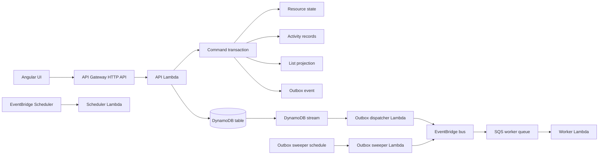

# Architecture Overview

JawStack v0.1 generates one resource workflow architecture for TypeScript, Angular, and AWS.

## Runtime Diagram



## Local Path

Local development uses:

- Angular through Vite.
- A Node HTTP adapter.
- In-memory persistence.
- Header-based auth context.

Local development does not emulate AWS services. It gives a fast command/runtime loop with the same resource metadata and command decisions.

## AWS Path

The generated CDK stack creates:

- API Gateway HTTP API.
- Lambda API handler.
- DynamoDB table with streams, TTL, and a projection/outbox GSI.
- EventBridge custom bus.
- Outbox dispatcher Lambda.
- Outbox sweeper Lambda plus schedule.
- Worker queues, DLQs, event rules, and Lambda handlers for configured workers.
- Scheduler Lambda, DLQ, and EventBridge Scheduler entries for configured schedules.
- CloudWatch log groups with explicit retention.

## Command Flow

```text
HTTP request
  -> resolve auth
  -> validate command input
  -> load current state when needed
  -> run command decision function
  -> transact state, activity, projection, idempotency, and outbox records
  -> return response
```

Event publication happens after the command transaction through the outbox dispatcher. A successful command response means the state and outbox records were committed; it does not mean async workers have completed.

## Generated Files

Important generated files:

- `jawstack.config.ts`: CLI config.
- `src/example.ts`: starter app name, resources, and cost profile.
- `src/api.ts`: local API server.
- `src/aws/runtime.ts`: AWS runtime wiring.
- `src/aws/api.ts`: API Lambda handler.
- `src/aws/outbox.ts`: dispatcher and sweeper handlers.
- `src/cdk.ts`: CDK app.
- `scripts/build-aws-entrypoints.mjs`: Lambda asset bundling.
